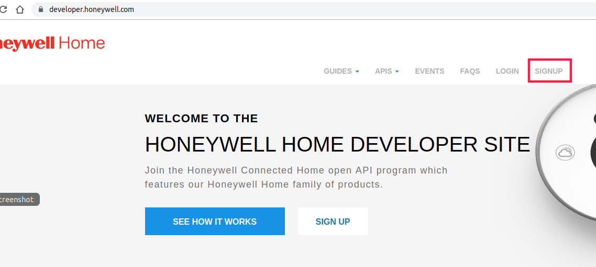
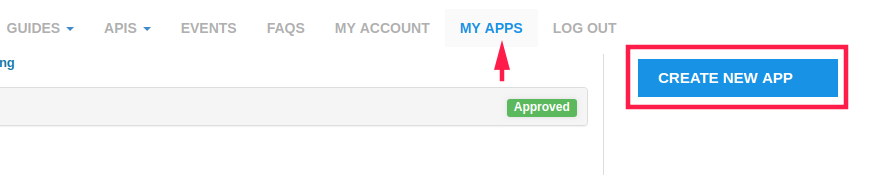
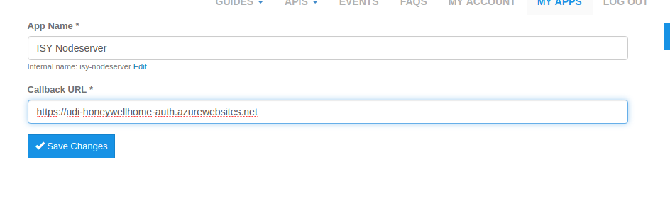
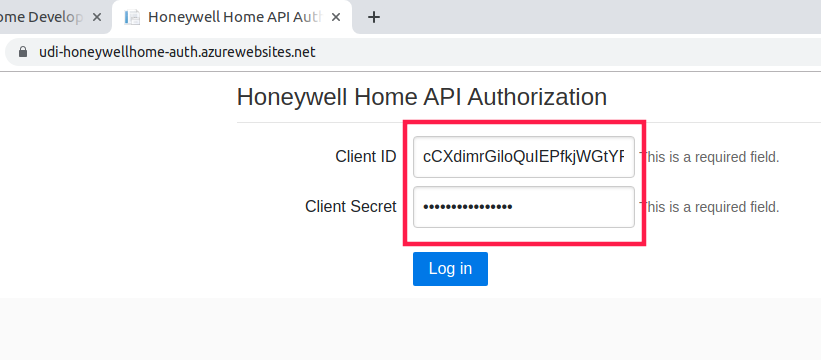
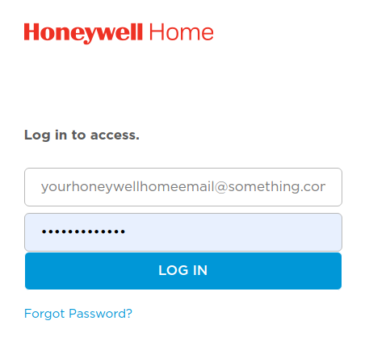
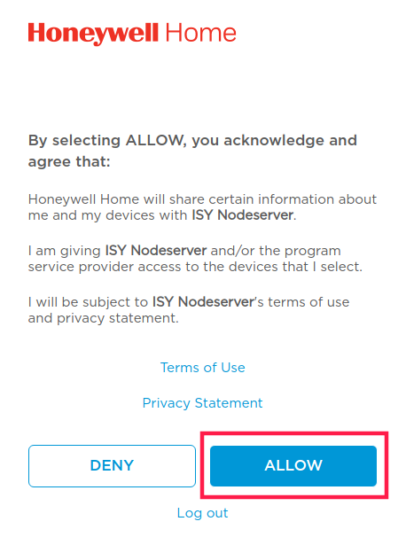
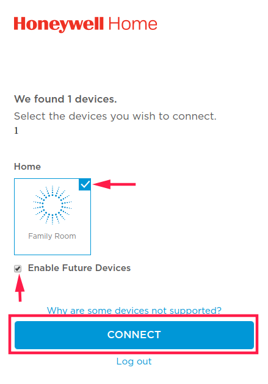
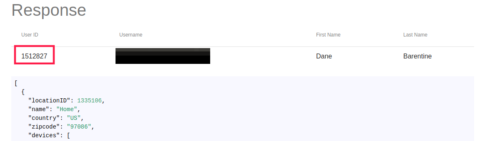
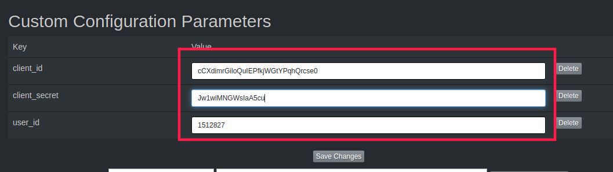

# Polyglot Honeywell Home

## Description
This project is a node server to integrate Honeywell Home thermostats into the UDI ISY. It is designed to run in UDI's [Polyglot v2](https://github.com/UniversalDevicesInc/polyglot-v2) server.

## Requirements
* [Honeywell Home](https://www.honeywellhome.com/) Wifi connected thermostat and Honeywell Home Login
* [Honeywell Developer Account](https://developer.honeywell.com) Free Honeywell Home developer account.

## Installation
* Clone into your polyglot nodeservers directory.
* Run install.sh to install dependencies
* Follow the configuration instructions below

## Configuration

This node server uses uses OAuth client credentials to authenticate to the API. To configure the node server we need to follow the following steps

1. Create API client
2. Authorize API client to access thermostat(s) and get user ID
3. Configure node server

## Create API client
The first step is to go to [https://developer.honeywell.com](https://developer.honeywell.com) and sign up for a developer account. This account is free.

Once your developer account is created we need to create the API client. This is done by clicking on MY APPS and then clicking the CREATE NEW APP button.

You will now see the create application screen.

Set the App Name name to whatever you like.

For the Callback URL use https://udi-honeywellhome-auth.azurewebsites.net. This is a web UI that will simplify the authorization part as well as retrieving the user ID. The code for this UI is here [udi-honeywellhome-auth](https://github.com/dbarentine/udi-honeywellhome-auth). This UI could be run locally as well you would just need to modify the callback url to use the localhost URL.

When finished click the Save Changes button.

## Authorize API client
We now need to authorize the client created above to allow it to access our thermostats. Click on the client's name which should display the Consumer Key (client ID) and Consumer Secret (client secret). We will need those for the next step.

Open another tab and go to [https://udi-honeywellhome-auth.azurewebsites.net](https://udi-honeywellhome-auth.azurewebsites.net).

**One thing to note, I am hosting this UI in a free Azure App Service. It is limited to 60 minutes of compute each day. So, if a lot of people are using it then it may be unavailable until the next day.**

Enter your Client ID (Consumer Key) and Client Secret (Consumer Secret) in the form and click Log in.

This will intiate a login process with Honeywell Home. You will need to enter your Honeywell Home user (email) and password.

After the login it will ask that you allow your client access to Honeywell Home. Click ALLOW.

The next screen will ask which devices you want it to have access to. This is mostly up to you but obviously if we don't have access to the thermostats this won't work. Click CONNECT once you've checked the devices you wish to connect.

At this point you will be redirected back to the UI. It may take a few seconds for it to refresh the page as it has to make some API calls in the background.

Once it's finished you should see a table with your user and some JSON below. This is how we know everything is working correctly. Keep track of the User ID as we will need it in the next step.

## Configure node server

The last step is to go into Polyglot and configure the Honeywell Home node server.

We need the client ID and client secret from the client we created as well as the user ID from the previous page.

Save Changes and restart the node server and it should discover any thermostats and sensors.
